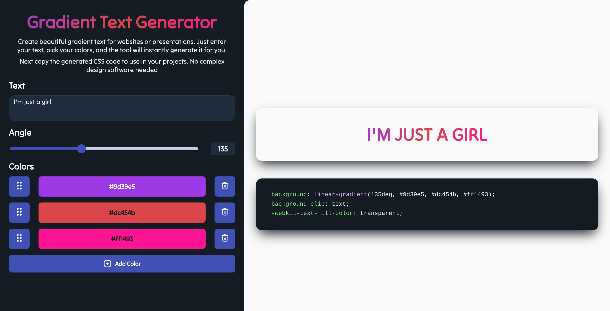

# Gradient Generator

A simple tool to generate CSS gradients.

[🚀 Generate Text Gradients!](https://magda98.github.io/gradient-generator/)

## Features

- 🎨 Create linear gradients with multiple color stops.
- 🖌️ Interactively change colors using a color picker.
- ✨ Add or remove colors from the gradient.
- 🔄 Adjust the gradient angle using a degree picker.
- 🖐️ Drag and drop to reorder colors.
- 📋 View and copy the generated CSS snippet.

## How to Use

1.  **Add Colors**: Click the '➕' icon to add a new color to the gradient.
2.  **Change Colors**: Click on any color swatch to open the color picker and select a new color.
3.  **Remove Colors**: Click the '🗑️' icon next to a color to remove it.
4.  **Adjust Angle**: Use the degree picker to set the angle of the gradient.
5.  **Copy CSS**: The CSS code for the gradient is automatically generated. Click the copy button in the code snippet section to copy it to your clipboard.

## Screenshots



---

## Development Information

This project was generated with [Angular CLI](https://github.com/angular/angular-cli).

### Local Development

To start a local development server, run:

```bash
ng serve
```

Navigate to `http://localhost:4200/`. The app will automatically reload if you change any of the source files.

### Build

Run `ng build` to build the project. The build artifacts will be stored in the `dist/` directory.

### Running unit tests

Run `ng test` to execute the unit tests via [Karma](https://karma-runner.github.io).
